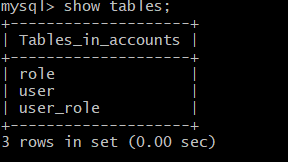

# Spring MVC Project Deployment with GitHub Actions and AWS

This project demonstrates the deployment of a Spring MVC application using **GitHub Actions** for CI/CD and **AWS** for infrastructure. The setup includes automated testing, Docker image building, deployment to AWS ECS (Elastic Container Service), and database management using AWS RDS (Relational Database Service).

---

## Table of Contents
1. [Introduction](#introduction)
2. [Project Overview](#project-overview)
3. [Prerequisites](#prerequisites)
4. [GitHub Actions Workflow](#github-actions-workflow)
5. [AWS Infrastructure Setup](#aws-infrastructure-setup)
6. [Terraform Configuration](#terraform-configuration)
7. [Dockerfile](#dockerfile)
8. [Security and Best Practices](#security-and-best-practices)
9. [Screenshots](#screenshots)

---

## Introduction

This project automates the deployment of a Spring MVC application using modern DevOps practices. The key components include:

- **GitHub Actions**: For continuous integration and deployment (CI/CD).
- **AWS ECR**: For storing Docker images.
- **AWS ECS**: For running the application in a containerized environment.
- **AWS RDS**: For hosting the MySQL database.
- **Terraform**: For infrastructure as code (IaC) to provision and manage AWS resources.

The goal is to create a seamless, secure, and scalable deployment pipeline for the Spring MVC application.

---

## Prerequisites

Before proceeding, ensure you have the following:

1. **GitHub Repository**: The Spring MVC application code should be hosted on GitHub.
2. **AWS Account**: An AWS account with the necessary permissions to create and manage ECR, ECS, RDS, EC2, and IAM resources.
3. **Terraform Installed**: Terraform should be installed on your local machine or CI/CD environment.
4. **Docker Installed**: Docker should be installed for building and pushing Docker images.
5. **SonarQube Account**: A SonarQube account for code quality scanning (optional but recommended).

---
## Project Overview

The project is divided into the following main components:

### GitHub Actions Workflow
- **Source Code Testing**: Runs Maven tests and performs a SonarQube scan to ensure code quality.
- **Build and Push to ECR**: Builds a Docker image and pushes it to AWS ECR.
- **Deploy to ECS**: Deploys the Docker image to AWS ECS using Fargate.

---
## Workflow Details

```yaml
name: Spring MVC Project Deployment

on:
  push:
    branches:
      - main  # Trigger only for pushes to the 'main' branch
  workflow_dispatch:

env:
  REGION: us-east-2

jobs:
  SourceCode_Testing:
    runs-on: ubuntu-latest
    steps:
      - name: Clone source code from the repo 
        uses: actions/checkout@v4.2.2

      - name: Maven Testing
        run: mvn test

      - name: Setup JDK11 for the workflow
        uses: actions/setup-java@v4
        with:
          distribution: 'temurin'
          java-version: '11'
      
      - name: Setup SonarQube
        uses: warchant/setup-sonar-scanner@v7

      - name: SonarQube Scan
        run: |
          sonar-scanner \
            -Dsonar.host.url=${{ secrets.SONAR_URL }} \
            -Dsonar.login=${{ secrets.SONAR_TOKEN }} \
            -Dsonar.organization=${{ secrets.SONAR_ORG }} \
            -Dsonar.projectKey=${{ secrets.SONAR_PROJECT_KEY }} \
            -Dsonar.sources=src/ \
            -Dsonar.java.binaries=target/test-classes/com/visualpathit/account/controllerTest/
          
  BUILD_AND_PUSH_TO_ECR:
    needs: SourceCode_Testing
    runs-on: ubuntu-latest
    steps:
      - name: Clone source code from the repo
        uses: actions/checkout@v4.2.2

      - name: Search and replace local variables with secrets
        run: |
          sed -i 's/^jdbc.username=.*/jdbc.username=${{ secrets.RDS_USER }}/' src/main/resources/application.properties
          sed -i 's/^jdbc.password=.*/jdbc.password=${{ secrets.RDS_PASSWORD }}/' src/main/resources/application.properties
          sed -i 's/db01/${{ secrets.RDS_ENDPOINT }}/' src/main/resources/application.properties

      - name: Build docker image and upload it to ECR
        uses: kciter/aws-ecr-action@v5
        with:
          access_key_id: ${{ secrets.AWS_ACCESS_KEY_ID }}
          secret_access_key: ${{ secrets.AWS_SECRET_ACCESS_KEY }}
          account_id: ${{ secrets.AWS_ACCOUNT_ID }}
          tags: latest,${{ github.sha }}
          repo: ecr-actions
          region: ${{ env.REGION }}
          dockerfile: ./Dockerfile
          path: "."

  DEPLOY_TO_ECS:
    needs: BUILD_AND_PUSH_TO_ECR
    runs-on: ubuntu-latest
    steps:
      - name: Set up AWS credentials
        uses: aws-actions/configure-aws-credentials@v4.0.2
        with:
          aws-access-key-id: ${{ secrets.AWS_ACCESS_KEY_ID }}
          aws-secret-access-key: ${{ secrets.AWS_SECRET_ACCESS_KEY }}
          aws-region: ${{ env.REGION }}

      - name: Deploy to ECS # This will work if you have ECS cluster with my configuration in 'infra' branch
        env:
          ECS_CLUSTER: ${{ secrets.ECS_CLUSTER }}
          ECS_SERVICE: ${{ secrets.ECS_SERVICE }}
        run: |
          aws ecs update-service --region ${{ env.REGION }} --cluster $ECS_CLUSTER --service $ECS_SERVICE --force-new-deployment
```
**IMPORTANT NOTE**:
This code will work if you have your image tagged with 'latest' every build, otherwise you should register the new taskdef to use the new image and update the service to use the new task def
---


## Secrets Configuration

Before running this workflow, configure the following secrets in your repository settings:

- `AWS_ACCESS_KEY_ID`: AWS access key.
- `AWS_SECRET_ACCESS_KEY`: AWS secret access key.
- `AWS_ACCOUNT_ID`: AWS account ID.
- `RDS_USER`: Database username.
- `RDS_PASSWORD`: Database password.
- `RDS_ENDPOINT`: RDS endpoint URL.
- `SONAR_URL`: SonarQube server URL.
- `SONAR_TOKEN`: SonarQube authentication token.
- `SONAR_ORG`: SonarQube organization name.
- `SONAR_PROJECT_KEY`: SonarQube project key.
- `ECS_CLUSTER`: ECS cluster name.
- `ECS_SERVICE`: ECS service name.

---

### AWS Infrastructure
- **ECR Repository**: Stores Docker images.
- **ECS Cluster and Service**: Manages the deployment and running of Docker containers.
- **RDS Instance**: Hosts the MySQL database for the application.
- **EC2 Instance**: Provides a client for accessing the RDS instance.
- **IAM Roles and Policies**: Manages permissions for ECS tasks and other AWS resources.
- **Security Groups**: Controls inbound and outbound traffic for EC2, RDS, and ECS resources.

### Terraform Configuration
- Terraform is used to define and provision the AWS infrastructure, including ECR, ECS, RDS, EC2, IAM roles, and security groups, you can find the terraform code in the 'infra' branch.

### Dockerfile
- A multi-stage Dockerfile is used to build the Spring MVC application and deploy it to a Tomcat server.

## Security and Best Practices

- **Sensitive Information**: Managed using GitHub secrets.
- **Code Quality**: Ensured through SonarQube integration.
- **Infrastructure as Code**: Managed using Terraform, ensuring consistency and reproducibility.

---

# Project Screenshots

This section provides an overview of the key steps and configurations for the project, supported by screenshots.

# Project Screenshots

This section provides an overview of the key steps, configurations, and static analysis results for the project, supported by screenshots.

---

## 1. Repository Secrets
  
*Shows the repository secrets configured for the project.*

---

## 2. MySQL Database Interaction
  
*Demonstrates interaction with the MySQL database, including showing tables and querying data.*

---

## 3. MySQL Tables
  
*Displays the tables available in the MySQL database.*

---

## 4. Project Directory Structure
  
*Shows the directory structure of the project, including key files like `application.properties` and SQL scripts.*

---

## 5. MySQL Connection
  
*Shows the successful connection to the MySQL database.*

---

## 6. Ubuntu Package Updates
  
*Displays the process of updating packages on an Ubuntu system.*

---

## 7. Static Analysis Results
  
*Shows the results of the static code analysis, including metrics like security, reliability, and maintainability.*

---

## 8. Setup Java JDK Action
  
*Displays the GitHub Action for setting up Java JDK.*

---

## 9. Repository Settings - Initial overview of Secrets
  
*Shows the repository settings for managing Actions secrets and variables.*

---

## 10. GitHub Checkout Action
  
*Shows the GitHub Action for checking out a repository.*

---

## 11. Git Configuration
  
*Displays the Git configuration for user name and email.*

---

## 12. Git SSH Configuration
  
*Shows the Git SSH configuration for the repository.*

---

## 13. Git Repository Cloning
  
*Demonstrates the process of cloning a Git repository.*

---

## 14. SSH Authentication
  
*Shows successful SSH authentication with GitHub.*

---

## 15. Adding SSH Key to GitHub
  
*Displays the process of adding a new SSH key to GitHub.*

---

## 16. Generating SSH Key
  
*Demonstrates the process of generating a new SSH key.*

## **Acknowledgements**
**Special thanks to the developers of the MVC application, for providing the base code for this project. I forked the project from [Visualpath IT]**